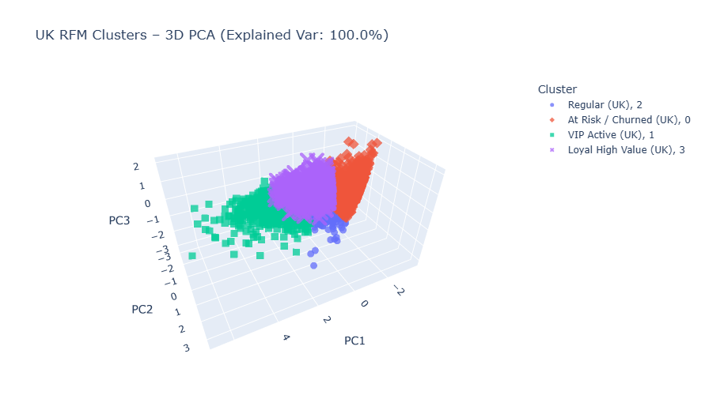

# 📊 Customer Segmentation & RFM Dashboard


*(Cluster Visualization Example)*

## 📌 Project Overview

This project is a comprehensive **Customer Segmentation Dashboard** designed to provide actionable business intelligence through data-driven analysis. By leveraging **RFM (Recency, Frequency, Monetary)** analysis and **K-Means Clustering**, the dashboard segments customers into distinct profiles, enabling targeted marketing strategies and clear visualizations for both **Global** and **UK** markets.

The core of the analysis is performed in Python (`customer_segmentation.ipynb`), and the results are visualized in a modern, interactive web dashboard.

---

## 🎯 Key Objectives

*   **Data-Driven Segmentation:** Classify customers based on purchasing behavior using K-Means clustering.
*   **Strategic Insights:** Provide tailored marketing strategies for each segment (e.g., VIP, At Risk).
*   **Market Comparison:** Analyze and compare customer behaviors between Global and UK markets.
*   **Product Bundling:** Identify cross-selling opportunities using market basket analysis (Apriori/F-PGrowth concepts).

---

## 📂 Project Structure

The project is organized efficiently to separate data processing, storage, and visualization.

```
RFM-Dashboard/
│
├── 📊 Analysis & Data Processing
│   └── customer_segmentation.ipynb     # Jupyter Notebook for RFM analysis & K-Means clustering
│
├── 🌐 Web Dashboard (Frontend)
│   ├── index.html                      # Main dashboard interface
│   ├── style.css                       # Modern, responsive styling
│   └── app.js                          # Dashboard logic & Chart.js rendering
│
├── 💾 Data Store
│   ├── rfm_kmeans_dashboard_data.json  # Consolidated output data (Global & UK)
│
└── 🖼️ Assets
    ├── global_cluster.png              # Static visualization of Global clusters
    └── uk_cluster.png                  # Static visualization of UK clusters
```

---

## 🧠 Methodology

### 1. RFM Analysis
We evaluate customers based on three key metrics:
*   **Recency (R):** How recently did the customer purchase?
*   **Frequency (F):** How often do they purchase?
*   **Monetary (M):** How much do they spend?

### 2. K-Means Clustering
Using the RFM scores, we apply the K-Means algorithm to group customers into 4 distinct segments:
*   **🏆 VIP Active:** High value, frequent buyers, recent activity.
*   **💎 Loyal High Value:** High spending, good frequency, stable.
*   **⚖️ Regular / Average:** Moderate spending and frequency.
*   **⚠️ At Risk / Churned:** High past value but no recent activity.

---

## 🛠 Technical Stack

*   **Data Science:** Python (Pandas, Scikit-learn, Matplotlib/Seaborn).
*   **Frontend:** HTML5, CSS3, Vanilla JavaScript (ES6+).
*   **Visualization:** [Chart.js](https://www.chartjs.org/) for dynamic charts and data storytelling.
*   **Data Interchange:** JSON for seamless integration between Python backend and Web frontend.

---

## 🚀 How to Run

### 1. Run the Analysis (Optional)
If you wish to re-generate the data:
1.  Open `customer_segmentation.ipynb` in Jupyter Notebook or VS Code.
2.  Run all cells to process the raw data and generate the `rfm_kmeans_dashboard_data.json` file.

### 2. Launch the Dashboard
Due to browser security policies (CORS), you cannot simply double-click `index.html`. You must serve it via a local web server.

**Recommended: VS Code Live Server**
1.  Open the project in **VS Code**.
2.  Install the **Live Server** extension.
3.  Right-click `index.html` and choose **"Open with Live Server"**.

**Alternative: Python HTTP Server**
```bash
# Run this inside the project directory
python -m http.server 8000
```
Then open `http://localhost:8000` in your browser.

---

## ✨ Dashboard Features

*   **Market Toggle:** Switch between Global and UK data instantly.
*   **Dynamic Profiles:** Real-time metrics for Segment Size, Avg Revenue, and RFM scores.
*   **Strategic Roadmap:** Actionable marketing initiatives and budget recommendations per segment.
*   **Bundling Strategy:** Top product combinations and "Frequently Bought Together" analysis.
*   **Interactive Charts:** Bubble charts for cluster visualization and bar charts for distribution.

---

**Author 1:** [Prayitno - M429D5Y1571]
**Author 2:** [Soraya Nakhbaty - M429D5X1865]
**Author 3:** [Hajatul Hiqmah - M429D5X0724]
**Last Updated:** December 2025

---

link github: https://github.com/pampam01/RFM-Dashboard-Complete-Final-10